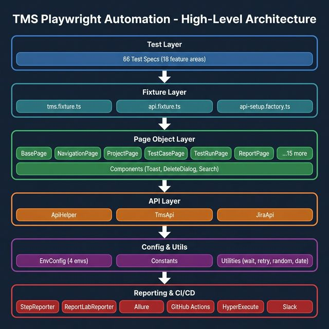
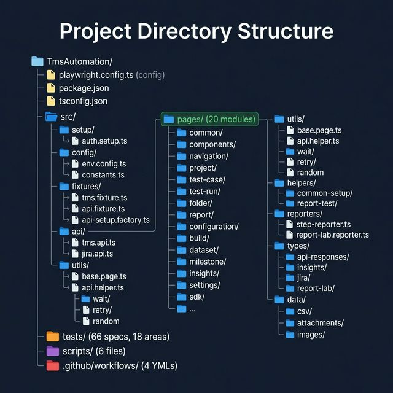
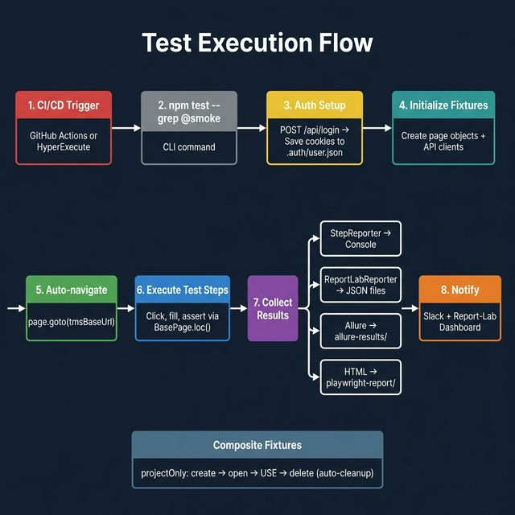
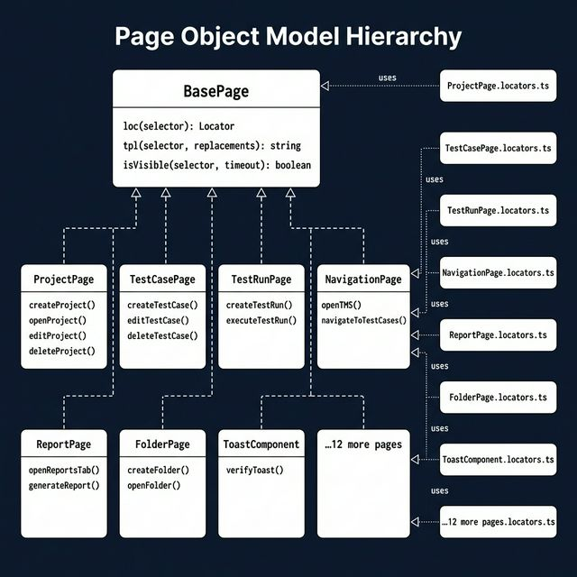
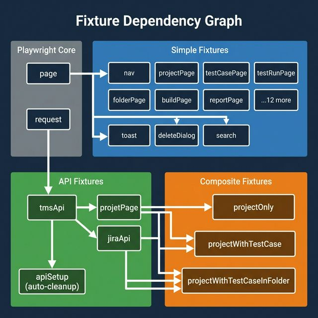
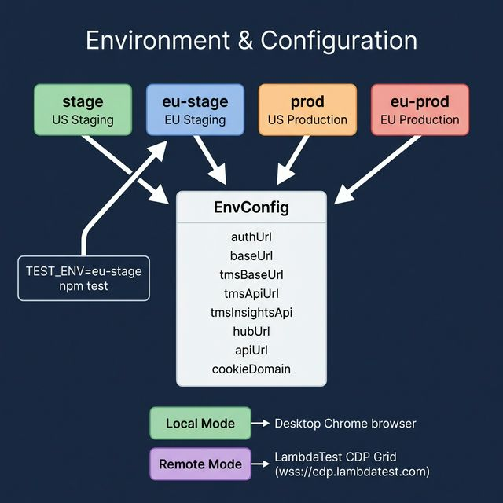
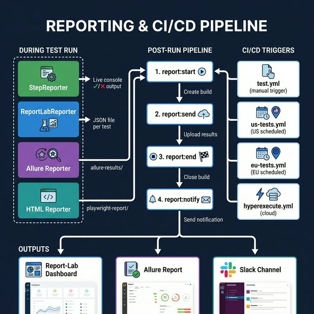

# TMS Playwright Automation — Architecture Document

> **LambdaTest Test Manager System (TMS)** end-to-end test automation built with Playwright + TypeScript.
> Supports 4 environments (US/EU × Staging/Prod), local & remote execution (LambdaTest grid), and integrates with Jira, KaneAI, Report-Lab, and Slack.

---

## 1. High-Level Architecture



The framework is organized into **6 layers** that cleanly separate concerns:

| Layer | Purpose | Key Files |
|-------|---------|-----------|
| **Test Layer** | 66 test specs across 18 feature areas | `tests/**/*.spec.ts` |
| **Fixture Layer** | Extends Playwright `test` with page objects + API | `tms.fixture.ts`, `api.fixture.ts` |
| **Page Object Layer** | UI interaction logic per feature | 20 modules in `src/pages/` |
| **API Layer** | REST API clients for TMS & Jira | `TmsApi`, `JiraApi`, `ApiHelper` |
| **Config & Utils** | Env config, constants, helper utilities | `EnvConfig`, `constants.ts`, `utils/` |
| **Reporting & CI/CD** | 4 reporters, GitHub Actions, HyperExecute | `reporters/`, `.github/workflows/` |

---

## 2. Directory Structure



```
TmsAutomation/
├── playwright.config.ts          # Multi-env config with LambdaTest remote grid
├── package.json                  # Scripts: test, test:smoke, test:eu, report:*
├── tsconfig.json                 # Path aliases: @config, @utils, @pages, @api
├── hyperexecute.yaml             # LambdaTest HyperExecute cloud config
├── .env / .env.example           # Environment variables
│
├── src/
│   ├── setup/                    # auth.setup.ts — API-based login → saves cookies
│   ├── config/                   # EnvConfig (4 envs) + Constants (timeouts, routes)
│   ├── fixtures/                 # Central fixture + API fixture + factory
│   ├── pages/                    # 20 Page Object modules (page + locators per feature)
│   ├── api/                      # TMS + Jira REST API clients
│   ├── utils/                    # BasePage, wait, retry, random, date, url helpers
│   ├── helpers/                  # Composite setup helpers (report, project+testcase)
│   ├── reporters/                # StepReporter (console) + ReportLabReporter (JSON)
│   ├── types/                    # TypeScript interfaces for API responses
│   └── data/                     # Test data: CSV, attachments, images
│
├── tests/                        # 66 test specs across 18 feature areas
├── scripts/                      # CLI wrappers, locator-finder, report-lab, slack
└── .github/workflows/            # US/EU test pipelines + HyperExecute trigger
```

---

## 3. Test Execution Flow



**Step-by-step:**

1. **CI/CD Trigger** — GitHub Actions (scheduled/manual) or HyperExecute cloud
2. **CLI** — `npm test --grep @smoke` resolves env → project mapping
3. **Auth Setup** — `auth.setup.ts` calls `POST /api/login`, saves cookies to `.auth/user.json`
4. **Initialize Fixtures** — `tms.fixture.ts` creates page objects + API clients lazily
5. **Auto-navigate** — Every test auto-navigates to `tmsBaseUrl` via the `page` fixture override
6. **Execute Steps** — Tests interact with the app via `BasePage.loc()` which auto-detects XPath vs CSS
7. **Collect Results** — 4 reporters run in parallel: StepReporter, ReportLab, Allure, HTML
8. **Notify** — Post-run scripts upload to Report-Lab dashboard and send Slack notifications

---

## 4. Page Object Model



### Pattern: Each feature has two files

| File | Purpose |
|------|---------|
| `*.locators.ts` | Static selector constants (XPath/CSS) |
| `*.page.ts` | Action methods extending `BasePage` |

### `BasePage` provides 3 core utilities:

- **`loc(selector)`** — Auto-detects XPath (starts with `/` or `(`) vs CSS selector
- **`tpl(selector, replacements)`** — Replaces `{{placeholders}}` in selector strings
- **`isVisible(selector, timeout)`** — Safe visibility check that never throws

### 20 Page Object Modules:

`project`, `test-case`, `test-run`, `folder`, `report`, `configuration`, `build`, `dataset`, `milestone`, `insights`, `settings`, `sdk`, `automation`, `kaneai`, `module`, `csv-import`, `jira-integration`, `navigation`, `common`, `components`

---

## 5. Fixture Dependency Graph



### Fixture Types:

| Type | Examples | Source |
|------|----------|--------|
| **Simple** | `nav`, `projectPage`, `testCasePage`, `toast` | `page` → `new XxxPage(page)` |
| **API** | `tmsApi`, `jiraApi`, `apiSetup` | `request` → `new TmsApi(request)` |
| **Composite** | `projectOnly`, `projectWithTestCase`, `projectWithTestCaseInFolder` | Combines multiple fixtures with auto-cleanup |

### Composite Fixtures (auto setup/teardown):

```
projectOnly:              create project → open → USE → delete
projectWithTestCase:      create project → open → create TC → USE → delete project
projectWithTestCaseInFolder: create project → open → create folder → create TC → USE → delete
```

---

## 6. Environment & Configuration



### 4 Environments × 2 Execution Modes:

| Environment | Region | URLs |
|-------------|--------|------|
| `stage` | US Staging | `stage-*.lambdatestinternal.com` |
| `eu-stage` | EU Staging | `stage-eu-*.lambdatestinternal.com` |
| `prod` | US Production | `*.lambdatest.com` |
| `eu-prod` | EU Production | `eu-*.lambdatest.com` |

| Mode | How | Config |
|------|-----|--------|
| **Local** | Desktop Chrome via Playwright | `TEST_MODE=local` (default) |
| **Remote** | LambdaTest CDP Grid | `TEST_MODE=remote` → `wss://cdp.lambdatest.com` |

---

## 7. Reporting & CI/CD Pipeline



### 4 Reporters (run in parallel during tests):

| Reporter | Output | Purpose |
|----------|--------|---------|
| `StepReporter` | Console with ANSI colors | Live `✓`/`✗` step-by-step visibility |
| `ReportLabReporter` | JSON file per test | Dashboard upload via post-run scripts |
| `Allure` | `allure-results/` directory | Rich HTML report with attachments |
| `HTML` | `playwright-report/` directory | Built-in Playwright report |

### CI/CD Workflows:

| Workflow | Trigger | Environment |
|----------|---------|-------------|
| `test.yml` | Manual | Configurable |
| `us-tests.yml` | Scheduled | US staging/prod |
| `eu-tests.yml` | Scheduled | EU staging/prod |
| `hyperexecute.yml` | Manual | Cloud (5 concurrency, autosplit) |

---

## 8. Key Design Patterns

| Pattern | Implementation | Benefit |
|---------|---------------|---------|
| **Page Object Model** | `*.page.ts` + `*.locators.ts` per feature | Separation of selectors from logic |
| **Base Page Abstraction** | `BasePage.loc()` auto-detects XPath vs CSS | Unified locator API |
| **Template Locators** | `BasePage.tpl()` replaces `{{placeholders}}` | Dynamic selectors cleanly |
| **Centralized Fixtures** | `tms.fixture.ts` extends `test` | All pages/APIs via destructuring |
| **Composite Fixtures** | `projectOnly`, `projectWithTestCase` | Auto setup/teardown with cleanup |
| **API-based Auth** | `auth.setup.ts` calls login API | Fast auth without UI |
| **API Setup Factory** | `api-setup.factory.ts` with auto-cleanup | Test data created/deleted via API |
| **Shared Components** | `ToastComponent`, `DeleteDialogComponent` | Reusable cross-feature interactions |
| **Common Locators** | `CommonLocators` object | Shared selectors (Delete, Edit, Create) |
| **Custom Reporters** | `StepReporter` + `ReportLabReporter` | Live visibility + dashboard integration |
| **CLI Wrapper** | `run-tests.js` / `pw.js` | Env→project resolution |

---

## 9. Feature Coverage Map

| Feature Area | Specs | Page Object | Tags |
|---|---|---|---|
| **Project** | 1 | ProjectPage | @smoke @regression |
| **Test Case** | 3 | TestCasePage | @smoke @regression |
| **Test Run** | 10 | TestRunPage | @smoke @regression |
| **Folder** | 6 | FolderPage | @regression |
| **Report** | 11 | ReportPage | @regression |
| **Configuration** | 9 | ConfigurationPage | @regression |
| **Milestone** | 3 | MilestonePage | @regression |
| **Insights** | 3 | InsightsPage | @regression |
| **Jira Integration** | 3 | JiraIntegrationPage | @regression |
| **SDK** | 3 | SdkPage | @regression |
| **CSV Import** | 3 | CsvImportPage | @regression |
| **Build** | 1 | BuildPage | @regression |
| **Automation** | 1 | AutomationPage | @regression |
| **Dataset** | 1 | DatasetPage | @regression |
| **Module** | 1 | ModulePage | @regression |
| **Settings** | 3 | SettingsPage | @regression |
| **KaneAI** | 1 | KaneaiPage | @regression |
| **API** | 3 | — (API only) | @smoke @regression |

---

## 10. Unnecessary Files & Cleanup Recommendations

### 10.1 Files to Remove

| File | Size | Reason |
|---|---|---|
| `image copy.png` | 233 KB | Duplicate of `java-to-ts.png` — leftover copy |
| `java-to-ts.png` | 233 KB | Migration artifact — no longer needed in repo root |
| `all-locators.md` | 74 KB | Generated locator dump — stale, auto-regeneratable via `locator-finder.js` |
| `COMPARISON.md` | 10 KB | One-time Java→TS migration comparison — historical only |
| `MIGRATION_REPORT.md` | 11 KB | One-time migration report — historical only |
| `COVERAGE.md` | 13 KB | Static coverage snapshot — will go stale immediately |
| `TEST-RESULTS.md` | 13 KB | Point-in-time test results — not live data |
| `test-list.md` | 9 KB | Static test list — duplicates `npx playwright test --list` |
| `bin/` directory | — | Likely empty or contains build artifacts |
| `allure-results/` | — | Generated artifacts — should be in `.gitignore` only |
| `playwright-report/` | — | Generated artifacts — should be in `.gitignore` only |
| `test-results/` | — | Generated artifacts — should be in `.gitignore` only |

**Estimated savings:** ~363 KB of unnecessary tracked files + generated directories.

### 10.2 Code-Level Improvements for Scalability

#### ① Consolidate `run-tests.js` and `pw.js`

These scripts share 80%+ duplicated logic (env parsing, project mapping). Merge into a single CLI entry point.

```diff
- scripts/run-tests.js   (51 lines)
- scripts/pw.js           (45 lines)
+ scripts/cli.js          (~55 lines, combined)
```

#### ② Add Barrel Exports for Pages

Currently `tms.fixture.ts` imports each page individually (20+ imports). Create barrel exports:

```
src/pages/index.ts          # export all page classes
src/helpers/index.ts         # export all helpers
src/types/index.ts           # export all types
```

#### ③ Move `BasePage` from `utils/` to `pages/`

`BasePage` is the parent class of all pages but lives in `utils/`. It belongs in `pages/base/`:

```diff
- src/utils/base.page.ts
+ src/pages/base/base.page.ts
```

#### ④ Extract Navigation Locators to a Separate File

`NavigationPage` has inline `Nav` locators instead of following the `*.locators.ts` convention:

```diff
+ src/pages/navigation/navigation.locators.ts
```

#### ⑤ Reduce `tms.fixture.ts` Complexity

The fixture file is 171 lines with 20+ definitions. Consider splitting into domain-specific fixtures and composing with `mergeTests()`.

#### ⑥ Standardize Locator Strategy

Current mix: XPath text-based (`//span[text()='Delete']`) + CSS (`input[placeholder='...']`). Neither is resilient to text changes. **Recommendation:** Add `data-testid` attributes and gradually migrate locators.

#### ⑦ Add `src/data/images/` to `.gitignore`

Binary test data bloats the repo. Use Git LFS or downloadable artifacts.

---

## 11. Scalability Roadmap

| Priority | Action | Impact |
|---|---|---|
| 🔴 **P0** | Remove stale docs/images from root | Clean repo, reduce noise |
| 🔴 **P0** | Ensure generated dirs are gitignored | Prevent accidental commits |
| 🟡 **P1** | Consolidate CLI scripts | Reduce maintenance burden |
| 🟡 **P1** | Add barrel exports | Cleaner imports, easier refactoring |
| 🟡 **P1** | Move `BasePage` to `pages/` | Logical grouping |
| 🟢 **P2** | Split fixture file | Better test composition |
| 🟢 **P2** | Migrate locators to `data-testid` | Reduced test flakiness |
| 🟢 **P2** | Add visual regression testing | Catch UI regressions |
| 🟢 **P2** | Add API response schema validation | Catch backend contract changes |

---

*Generated on 2026-02-12 from repository analysis.*
